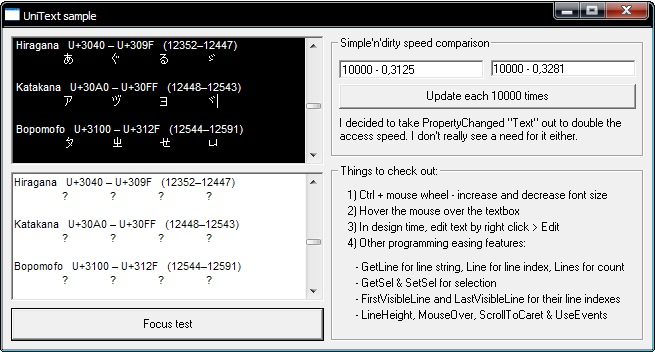



## UniText RC3 &amp; UniList RC1 \[2008\-06\-14\]

### Description

Unicode textbox and listbox. On these controls I've attempted to mimic the behavior and features of the native controls, but also give much more power by implementing much more of the native features provided by the Windows API. Despite the focus being on implementing Unicode aware versions of the native controls, you can find much more power than just the Unicode. 

----

These Release Candidates are released outside the main UniControls release for bug testing and comments - thus I'd like to hear of any problems or oddness you may encounter with the controls so that I can fix them before compiling the main UniControls release (thus the next UniControls release is to be considered stable). 

----

UniControls main release: http://www.planet-source-code.com/vb/scripts/ShowCode.asp?txtCodeId=69738&amp;lngWId=1
 
### More Info
 

             |
---                |---
**Submitted On**   |2008-06-10 23:36:16
**By**             |[Vesa Piittinen](https://github.com/Planet-Source-Code/PSCIndex/blob/master/ByAuthor/vesa-piittinen.md)
**Level**          |Advanced
**User Rating**    |5.0 (25 globes from 5 users)
**Compatibility**  |VB 6\.0
**Category**       |[Custom Controls/ Forms/  Menus](https://github.com/Planet-Source-Code/PSCIndex/blob/master/ByCategory/custom-controls-forms-menus__1-4.md)
**World**          |[Visual Basic](https://github.com/Planet-Source-Code/PSCIndex/blob/master/ByWorld/visual-basic.md)
**Archive File**   |[UniText\_RC2116676132008\.zip](https://github.com/Planet-Source-Code/vesa-piittinen-unitext-rc3-amp-unilist-rc1-2008-06-14__1-70658/archive/master.zip)

